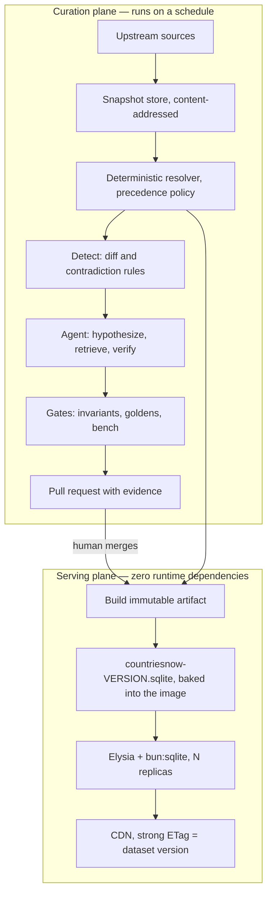

# Architecture

## The one decision everything else follows from

There are two planes, and they share no runtime dependency.



The curation plane can be broken for a week and the API will not notice. That is the
point. "API is down" was filed eleven separate times against V1 — #239, #234, #233,
#232, #225, #216, #203, #202, #201, #90, #88 — making it by volume the loudest complaint
in the tracker, and not one of those was a code defect. They were a runtime dependency
being unavailable.

A replica here has nothing to be unavailable. It opens a file at startup and serves from
the page cache. There is no pool, no socket, no retry, no migration on boot, and no
upstream to wait for, so a cold start is milliseconds and a rolling restart is
uneventful.

The cost is that data changes require a deploy. For a dataset of ~250 countries that
changes a few times a month, that is a good trade — and it buys atomicity, because the
image tag and the dataset version are the same fact, so a rollback rolls back the data
too.

## Why the dataset is not in Postgres at request time

The dataset is small and read-mostly. Querying a database per request is latency spent on
data that is immutable between releases, plus an availability dependency for no benefit.

Postgres and Drizzle still exist in the repository, and still matter — for the curation
pipeline, where writes, history and review state are real requirements. They are simply
not on the request path.

## The serving plane

**Bun + Elysia + `bun:sqlite`.** Elysia benchmarks around 255k req/s on Bun against
Express-on-Node's ~16k, but throughput is not why it was chosen. TypeBox gives runtime
validation, TypeScript types, and the OpenAPI document from one definition. V1 hand-wrote
33 files under `swagger/` and they drifted so far that the published docs still describe
`POST` endpoints replaced by `GET` in 2022. Schema-derived docs make that class of drift
impossible rather than merely discouraged.

The trade is Bun lock-in. Hono would keep the door open to Workers and Deno. Given that
the artifact is a local file, Bun is the better fit.

### Request path

1. `resolve(ref)` turns whatever the caller sent into a stable key.
2. One indexed SQLite query.
3. Shape, apply `?fields=`, wrap in the envelope.

No I/O beyond the page cache. Measured in-process:

| | p50 | p99 |
| --- | --- | --- |
| resolve a country by code or name | 12.0 µs | 23.2 µs |
| resolve a subdivision | 10.7 µs | 29.0 µs |
| list all countries | 312.6 µs | 536.9 µs |
| a paginated city page | 25.5 µs | 54.3 µs |

`bun run harness:bench` reproduces these, and `--ci` fails the build on regression.

### Caching

Every response carries `ETag: "<dataset version>"`. The validator is derived from the
data, not from the process, so every replica emits the same one for the same content and
a CDN can serve them interchangeably. Conditional requests are answered in `onRequest`,
before the body is built. HEAD is re-dispatched as GET with the body dropped, because a
cache that validates with HEAD and gets a 404 stops caching the resource entirely.

`Cache-Control: public, max-age=86400, stale-while-revalidate=604800`. The
`stale-while-revalidate` window is what stops a release from becoming a stampede.

## The data model

Every V1 data bug traces to one root cause: six independent files in `model/` totalling
33.7 MB with **no shared join key**. `countriesAndCities.js` and `countriesAndFlag.js`
have no identifier at all, only the country name as a string, so the same country is
spelled differently in each file and they drift apart. Greece was `EL` in one and `GR` in
another. The Bahamas had to be fixed twice on the same day in two different files.
`countriesAndState.js` held two records both literally named `Congo`, which made the DRC
permanently unreachable by name.

V2 keys everything and records where each field came from:

```
countries(id, iso2 UNIQUE, iso3 UNIQUE, iso_numeric, geonames_id, wikidata_qid,
          un_member, iso_status, independent, ...)
subdivisions(id, country_id, iso_3166_2 UNIQUE, parent_id, level, type,
             geonames_admin1, wikidata_qid)
places(id, country_id, subdivision_id, geonames_id UNIQUE, feature_code,
       population, population_year, lat, lon)
names(entity_type, entity_id, locale, name, kind, source)
field_provenance(entity_type, entity_id, field, source, source_version,
                 retrieved_at, confidence)
```

Two of these earn their keep repeatedly.

**`names`** is one table that fixes three separate problems. It holds official names,
aliases and localizations together, so `?locale=de` (issue #215), `?country=Reunion`
without the accent, and `DRC` as a shorthand are all the same lookup. 5,791 name rows
across 21 locales for countries alone.

**`field_provenance`** is what makes the AI layer trustworthy instead of another source
of drift. 5,221 rows saying which source supplied each published value, at which version,
when. Issue #236 — Bulgaria adopting the euro — stayed open partly because nothing
recorded where `BGN` came from or when. `GET /v2/countries/BG?include=provenance` answers
that now.

Values this project decides itself, rather than reads from an upstream, are recorded with
`source: 'policy'` and the policy revision. A hand-made decision is as traceable as a
fetched one.

### Resolution

One function, used by every endpoint, so behaviour cannot diverge between routes:

1. NFKD normalize
2. strip combining marks
3. casefold
4. collapse punctuation and whitespace
5. look up in `names`
6. exactly one match wins; several is a 409 naming all of them

V1 did `.find()` with `.toLowerCase()` in each handler independently, which is why
`?country=Réunion` worked and `?country=Reunion` returned 404.

Ambiguity being an answer rather than a coin flip is the substantive change. V1 returned
the first array match and the second entity was unreachable forever.

## Issue #242, and why it generalizes

The neighbourhoods complaint was a missing GeoNames `feature_code` filter. Filtering
Provence-Alpes-Côte d'Azur returns 2,886 `PPL` but also 170 `PPLX` — Mazargues, La
Blancarde, Sainte-Marguerite, all Marseille *neighbourhoods* — and 16 `PPLA5`, the
Marseille arrondissements. That is verbatim the bug report.

"Just use cities15000" does not fix it: that file is 34,076 rows of which 2,365 are
`PPLX`.

```sql
feature_class = 'P'
AND feature_code IN ('PPL','PPLA','PPLA2','PPLA3','PPLC','PPLG')
-- PPLA4/PPLA5 admitted only when not contained in a larger PPL* per hierarchy.zip
```

Using `hierarchy.zip` for containment means neighbourhoods can be *exposed* as a child
resource (`/v2/cities/{ref}/neighbourhoods`) instead of discarded. It also closes the
duplicate-cities complaints: Marseille appeared once as `PPLA` plus sixteen more times as
arrondissements.

The generalizable part: the fix is a rule in `harness/policy/places.ts` and an invariant
in `harness/src/gates/invariants.ts`, not a filter in a handler. It cannot regress
silently.

## Compatibility

`/v0.1` reproduces all 29 V1 routes — including the ones exposed under both `GET` and
`POST` — over the V2 engine. Compatibility is proven by replaying responses captured from
the live V1 service, so the shim reproduces V1's inconsistencies deliberately:
`populationCounts` is an array on one endpoint and a bare object on another because that
is what V1 returned.

Three V1 behaviours are deliberately *not* reproduced, because they are defects rather
than contracts:

- `/cities/q` returned HTTP 500 for 23 countries. The guard was `if (!DB1 && !DB2)` and
  the next line destructured `DB1`.
- Unaccented lookups 404'd.
- `Congo` silently resolved to one of two records.

See [MIGRATION.md](MIGRATION.md).

## Licensing, as an architectural constraint

Three of the most convenient datasets — `dr5hn/countries-states-cities-database`,
`mledoze/countries`, and Overture divisions — are ODbL 1.0 with share-alike. If they fed
the published database, CountriesNow's output would plausibly become a Derivative
Database and inherit the copyleft, which would then bind every downstream consumer of a
free public API.

So ingest is permissive-only. ODbL sources live in a quarantined lane that may inform
reconciliation but never writes a published value, and that boundary is asserted by an
invariant rather than trusted. Output is CC BY 4.0. See [ATTRIBUTION.md](ATTRIBUTION.md).

## What is deliberately absent

- **No auth, no rate limit.** Behind a CDN with a 24-hour TTL and immutable data, the
  origin sees a small fraction of traffic.
- **No write API.** Corrections go through the harness, which is auditable.
- **No GraphQL yet** (#121). Sparse fieldsets satisfy most of that request. If it lands,
  it is a thin layer over the same resolvers.
- **No per-request database.** Covered above at length.
