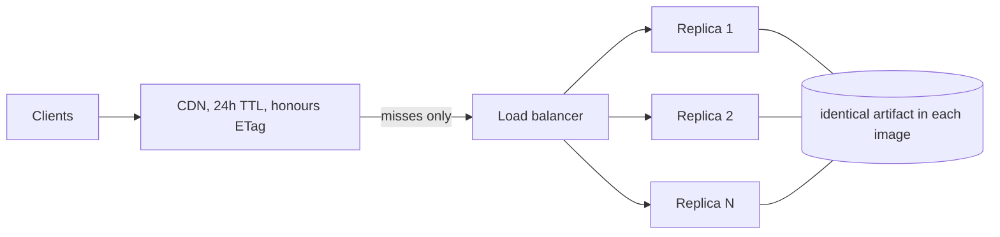

# Deployment

## The shape of it

The serving image contains the dataset. A replica opens a file at startup and serves from
the page cache; there is no database to reach, no migration to run, no upstream to wait
for. Scaling out is running more copies of the same image. There is no coordination
between them.

That has three consequences worth designing around:

1. **A release is a data release.** The image tag *is* the dataset version, so rolling
   back the deploy rolls back the data with it.
2. **Replicas are interchangeable.** They emit the same `ETag` for the same content
   because the validator is the dataset version, not something per-process. A CDN in
   front can serve any replica's response to any client.
3. **Nothing is stateful.** Any platform that runs N copies of a container will do.



## Building the image

The Dockerfile expects the artifact in the build context at
`data/artifacts/countriesnow.sqlite`. Locally:

```bash
bun run harness:pull
bun run harness:resolve
bun run harness:publish
cp data/artifacts/countriesnow-*.sqlite data/artifacts/countriesnow.sqlite
docker build -t countriesnow:local .
docker run -p 3000:3000 countriesnow:local
```

`GEONAMES_TIER=allCountries` for a production build. That is ~400 MB of upstream data
producing a ~1.4 GB artifact; `cities15000` produces ~36 MB and is what CI uses.

In CI this is `.github/workflows/release.yml`, which builds the artifact, runs all three
gates against it, bakes it into an image tagged with the dataset version, attaches the
SQLite file to a GitHub release, and rolls the fleet.

## Configuration

| Variable | Default | |
| --- | --- | --- |
| `PORT` | `3000` | |
| `COUNTRIESNOW_ARTIFACT` | newest under `data/artifacts` | pin this in production |
| `CACHE_MAX_AGE` | `86400` | seconds, into `Cache-Control` |

Nothing else. There are no credentials, because there is nothing to authenticate to.

## Health

Liveness and readiness are separate endpoints and the distinction matters.

- **`GET /health`** answers without touching the artifact. It says the process is up.
- **`GET /ready`** returns 503 if no artifact is loaded, and otherwise reports the dataset
  version, build time and artifact size.

Route on `/ready`. A replica whose artifact failed to load is alive but must not receive
traffic, and conflating the two is how a bad deploy takes down a healthy fleet. The
process deliberately does *not* exit when the artifact is missing — crash-looping tells
an orchestrator less than a steady 503 does.

`/ready` is also how a deploy is verified. The release workflow polls it until every
replica reports the new version, because a deploy that reports success while replicas
still serve the old data is worse than one that fails outright.

## Fly.io

`fly.toml` is committed and configured for two machines minimum.

```bash
fly launch --no-deploy      # first time only
fly deploy
fly scale count 4
```

Two is a floor rather than a target: with one replica a deploy is an outage, which is the
failure mode this rebuild exists to remove.

Memory is set to 1 GB so the page cache can hold the working set. After the first few
requests the hot pages are resident and a query never touches disk. Under-provisioning
memory is the one way to make this architecture slow.

## Heroku (classic buildpack)

V1 lived on Heroku; V2 prefers a container image (Fly / Cloud Run / the
Dockerfile). Classic `git push heroku` still works, with two caveats the Node
buildpack alone does not cover:

1. **Bun is not on the Node buildpack.** `heroku-prebuild` installs it into the
   slug; the `Procfile` puts `$HOME/.bun/bin` on `PATH` at boot.
2. **The SQLite artifact is not in git.** `heroku-postbuild` runs
   pull → resolve → publish (`GEONAMES_TIER=cities15000` by default) and writes
   `data/artifacts/countriesnow.sqlite` into the slug.

There is intentionally **no** `build` script in `package.json`. Heroku's Node
buildpack auto-runs `npm run build` when that script exists; ours called `bun`
and failed with `bun: not found`. Optional bundling lives under `bun run bundle`.

```bash
heroku config:set COUNTRIESNOW_ARTIFACT=/app/data/artifacts/countriesnow.sqlite
git push heroku master
```

For production-scale GeoNames data, build the Docker image via
`.github/workflows/release.yml` and deploy that image instead — Heroku's
15-minute compile window and 500 MB slug limit are a poor fit for
`allCountries`.

**Cloud Run** — `--min-instances=2 --cpu=1 --memory=1Gi`, and set the startup probe to
`/ready`. Scale-to-zero works but adds cold starts to the p99 for no saving worth having.

**Kubernetes** — a plain `Deployment` with `replicas: 3`, a `readinessProbe` on `/ready`
and a `livenessProbe` on `/health`. No volumes, no ConfigMaps, no Secrets. A
`PodDisruptionBudget` of `minAvailable: 1` is worth having.

**ECS/Fargate** — a service with `desiredCount: 2` and the ALB target group health check
on `/ready`.

## The CDN

This is where the design pays off. Responses are immutable between dataset versions and
carry a strong `ETag` equal to the version, so a CDN can hold them for a long time and
revalidate cheaply.

```
Cache-Control: public, max-age=86400, stale-while-revalidate=604800
ETag: "2026.08.0"
```

`stale-while-revalidate` is the part that stops a release becoming a stampede: during the
roll, caches keep serving the previous response while they fetch the new one in the
background.

Configuration that matters:

- **Cache `/v2/*` and `/v0.1/*` aggressively.** Include the query string in the cache key
  — `?fields=`, `?locale=`, `?limit=` and `?cursor=` all change the response.
- **Do not cache `/health` or `/ready`.** They are supposed to reflect right now.
- **Honour `ETag`** and forward `If-None-Match`. Most revalidation traffic then costs a
  304 with no body.
- **Purge on release** if you want the new data visible immediately rather than within
  the TTL. The `ETag` changes with the version, so correctness does not depend on the
  purge — only latency of propagation does.

There is no auth and no rate limit. Behind a CDN with a 24-hour TTL, the origin sees a
small fraction of traffic, and the failure mode of a traffic spike is a CDN bill rather
than an outage.

## Rollback

```bash
fly deploy --image ghcr.io/<owner>/<repo>:2026.07.0
```

The previous dataset comes back with the previous code, because they were never separate
artifacts. Verify with `curl https://countriesnow.space/ready`.

## Operating notes

**A bad curation run** is a `git revert` of the proposal PR followed by a release. The
agent cannot write to published data, so the worst case is a merged bad proposal, and
that is a normal revert.

**A GeoNames outage** stops the pipeline and does nothing to the API. Snapshots are
content-addressed and cached; `--offline` rebuilds from them.

**Disk** is the artifact plus the image. Snapshots (hundreds of megabytes) live only on
the curation runner, never in the serving image — `.dockerignore` enforces that.

**Monitoring**: the p99 of `/v2/countries` is the useful signal. If it moves, either the
page cache is thrashing (add memory) or the artifact grew a lot (check the release diff).
`harness bench --ci` catches the second case before it deploys.
